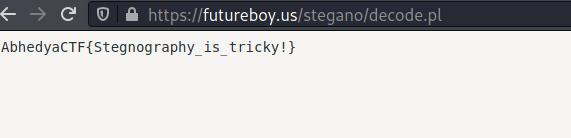
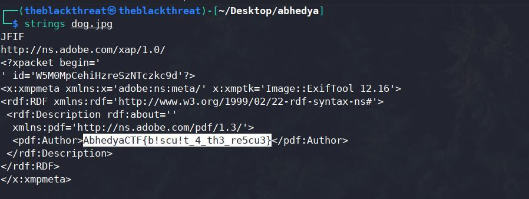

  RED="\033[1;31m"
GREEN="\033[1;32m"
echo "Welcome!"
 "++++++2021-CTF-Challenge-Abhedya+++++++"


Inspect_me: http://164.52.211.11:9001/
Enumeration: Ths this challenge as the name says that inspect me. and is something
about inspect

<br/>
In this challenge May be there is XSS vulnerability but here I I injects some scripts
but it won’t woks for the flags.
<br/>
<SRC=# onmouseover="alert('theblackthreat welcome you.')">
 
but it didn’t work so I look around to the source file and I found something intersting.
the function for button tag where we can inject our script.

Page source http://164.52.211.11:9001/javas.js

```
var secretCode = "X01lZWVffQ==";
 </br>
document.getElementsByTagName('button').onclick=function() { </br>
click(); </br>
}  </br>
function click() { </br>
document.getElementById("he").innerHTML = "You Can't find me..."; </br>
} 
```
![2.jpg]
    <br/>
So the secretCode is ```X01lZWVffQ==```
<br/>
It will looks like base64 so i decode it I got the flag
<br/>
seems that the name is the flag.
<br/>
Result Flag:
<br/>
<u>AbhedyaCTF{_Meee_}}</u>
<br/>
*****************************************************************************************************************
<br/>
Reverse: 
<br/>
1. Challenge 
</br>
https://drive.google.com/file/d/**********************8/view?usp=sharing

In this challenge First I gave the permission to the a.out file and execute it it will ask for key: whcih i don’t 
know but overall thing is that we need to grep the flag by anyway.
<br/>
Step 1: First I open the file on Ghidra to know how it works.

![3.jpg]
</br>

Here i see that the code that is asking for:

```
undefined8 main(void)
{
undefined8 local_38;
undefined8 local_30;
undefined8 local_28;
undefined4 local_20;
undefined local_1c;
int local_14;
int local_10;
int local_c;
local_38 = 0x4361796465686241;
local_30 = 0x72657665727b4654;
local_28 = 0x5f73695f676e6973;
local_20 = 0x6c6f6f63;
local_1c = 0x7d;
local_10 = 0x2687;
printf("enter the key: ");
13}
__isoc99_scanf(&DAT_00102014,&local_14);
if (local_10 == local_14) {
for (local_c = 0; local_c < 0x1d; local_c = local_c + 1) {
putchar((int)*(char *)((long)&local_38 + (long)local_c));

}
}
else {
printf("wrong key, try again");
}
return 0;
}
```

The logic is that first the key value should be equal to local_10 and the Input is contain by Local_14 here we can see that (local_10 == local_14) so the key value is
0x2687 in binary and in decimal it will be 2687. but the proper configuration may
not work here and I don’t had much time do.
So i find another way to find the flag the misconfiguration of the code helped me a
lot.
The linux tool stings is so usefull to extract the infromation
</br>
![4.jpg]


```
$ string ./a.out
strings ./a.out
/lib64/ld-linux-x86-64.so.2
Y`]G
__isoc99_scanf
putchar
printf
__cxa_finalize
__libc_start_main
libc.so.6
14GLIBC_2.7
GLIBC_2.2.5
_ITM_deregisterTMCloneTable
__gmon_start__
_ITM_registerTMCloneTable
u/UH
AbhedyaCH
TF{reverH
sing_is_H
cool
```

here is the
Flag: AbhedyaCTF{reversing_is_cool}

<br/>
*****************************************************************************************************************
<br/>

2. Decrypt Language:
https://drive.google.com/file/d/******************************/view?usp=sharing

In this chellenge I got a python script that supports the 3 version of pyhton so it is one kind of a algorithm that 
can decode the number so string
of order n ords= [73, 72, 1, 92, 109, 2, 84, 109, 66, 75, 70, 90, 2, 92, 79]

```
import sys
if sys.version_info.major == 2:
print("You are running Python 2, which is no longer supported. Please update to
Python 3.")
ords = [73, 72, 1, 92, 109, 2, 84, 109, 66, 75, 70, 90, 2, 92, 79]
print("".join(chr(o ^ 0xn) for o in ords))
```

I need to change the code because there is no order of n specified but the strings can
major of n=32
Modified code

```
import sys
if sys.version_info.major == 2:
print("You are running Python 2, which is no longer supported. Please update to
Python 3.")
ords = [73, 72, 1, 92, 109, 2, 84, 109, 66, 75, 70, 90, 2, 92, 79]

print("".join(chr(o ^ 0x32) for o in ords))


#Again run the script using python3


```
<br/>
```
$python3 Rev\ -2-find_n.py
{z3n_0f_pyth0n}
```

![5.jpg]
<br/>

Result : Flag:
AbhedyaCTF{z3n_0f_pyth0n}
<br/>
************************************************************************************************************
<br/>

Forensics:
1. Harry Potter
https://drive.google.com/file/d/**************************/view?usp=sharing
Methodology : In this challenge the music has have some encoded massage and I have
to find it so I use the stings tool on linux and I found some information about that
image.

```
$ strings harry-potter-ringtone\ \(1\).wav
RIFF
WAVEfmt
LIST
INFOIART
www.ringtonedownload.best
ICMT
www.ringtonedownload.best
IGNR
www.ringtonedownload.best
IPRD
www.ringtonedownload.best
ISFT
Basic details of the ringtone.
File name: harry-potter-ringtone.mp3
File type: audio/mpeg
File size: 752 KB
Length: 32 seconds
Bitrate: 192kb/s CBR
```
  <br/>
I need to decrypt the audio file so a little bit google search helped me to do this
I found Steganographic Decoder

https://futureboy.us/stegano/decinput.html
Result: Flag: AbhedyaCTF{Stegnography_is_tricky!}

<br/>
*****************************************************************************************************************
<br/>

2. Don’t think for a second this is some cute Lil puppy. He took off with some
important note, can
you catch him to retrieve the important note?
![7.jpg]
This lil puppy have some note the hint that given is in this image there is a important
note.
so after getting the hint I was able to extract the Information from this image.
I use the strings linux tool to decode the image

```
strings dog.jpg
JFIF
http://ns.adobe.com/xap/1.0/
<?xpacket begin='
' id='W5M0MpCehiHzreSzNTczkc9d'?>
<x:xmpmeta xmlns:x='adobe:ns:meta/' x:xmptk='Image::ExifTool 12.16'>
<rdf:RDF xmlns:rdf='http://www.w3.org/1999/02/22-rdf-syntax-ns#'>
<rdf:Description rdf:about=''
xmlns:pdf='http://ns.adobe.com/pdf/1.3/'>
<pdf:Author>AbhedyaCTF{b!scu!t_4_th3_re5cu3}</pdf:Author>
</rdf:Description>
</rdf:RDF>
</x:xmpmeta>
<?xpacket end='w'?>
```

In the above code a flag is hidden.

<b>Flag:
AbhedyaCTF{b!scu!t_4_th3_re5cu3}</b>
